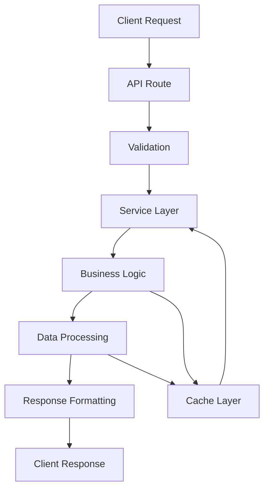

# 📁 Estructura del Backend

## 🏗️ Organización General

El backend está organizado en una estructura modular que facilita el mantenimiento, escalabilidad y desarrollo de nuevas funcionalidades.

```
backend/
├── 📁 api/                    # Endpoints de la API
│   └── 📁 agency-rates/
│       └── 📄 route.ts       # Rutas para tasas de agencia
├── 📁 services/              # Lógica de negocio
│   └── 📄 agency-rates.service.ts  # Servicio de tasas
├── 📁 types/                 # Definiciones TypeScript
│   └── 📄 agency-rates.ts  # Tipos del sistema
├── 📁 utils/                 # Utilidades compartidas
│   └── 📄 response-helpers.ts  # Helpers para respuestas
├── 📁 docs/                  # Documentación
│   ├── 📄 API_AGENCY_RATES.md    # Documentación API
│   └── 📄 BACKEND_STRUCTURE.md   # Estructura (este archivo)
└── 📁 tests/                 # Tests (por implementar)
    ├── 📁 unit/
    ├── 📁 integration/
    └── 📁 e2e/
```

## 🔧 Componentes Principales

### 1. 📁 api/
Contiene todos los endpoints REST de la aplicación.

**Principios:**
- Cada feature tiene su propia carpeta
- Manejo de errores centralizado
- Validación de entrada
- Respuestas estandarizadas

**Ejemplo de estructura:**
```
api/feature-name/
├── route.ts           # Endpoints principales
├── middleware.ts      # Middleware específico
├── validators.ts      # Validaciones
└── helpers.ts        # Helpers de la feature
```

### 2. 📁 services/
Contiene la lógica de negocio del sistema.

**Principios:**
- Patrón Singleton para servicios globales
- Separación de responsabilidades
- Inyección de dependencias
- Manejo de estado persistente

**Tipos de servicios:**
- **Data Services:** Manipulación de datos
- **Business Services:** Lógica de negocio
- **External Services:** Integración con APIs externas
- **Cache Services:** Gestión de caché

### 3. 📁 types/
Definiciones TypeScript para todo el sistema.

**Organización:**
- **Entities:** Tipos de datos principales
- **DTOs:** Data Transfer Objects
- **Interfaces:** Contratos de servicios
- **Enums:** Constantes y opciones

### 4. 📁 utils/
Funciones y utilidades compartidas.

**Categorías:**
- **Response Helpers:** Formateo de respuestas
- **Validation Helpers:** Validaciones comunes
- **Format Helpers:** Formateo de datos
- **Security Helpers:** Utilidades de seguridad

## 🔄 Flujo de Datos



## 📋 Patrones y Convenciones

### 🎯 Patrones de Diseño Utilizados

1. **Singleton Pattern**
   - Servicios globales (AgencyRatesService)
   - Configuración compartida

2. **Repository Pattern**
   - Abstracción de acceso a datos
   - Facilita testing

3. **Factory Pattern**
   - Creación de objetos complejos
   - Manejo de dependencias

4. **Observer Pattern**
   - Notificación de cambios
   - Reactividad del sistema

### 📝 Convenciones de Código

1. **Nomenclatura**
   - **Files:** kebab-case (`agency-rates.service.ts`)
   - **Classes:** PascalCase (`AgencyRatesService`)
   - **Methods:** camelCase (`calculateRates`)
   - **Constants:** UPPER_SNAKE_CASE (`MAX_ADJUSTMENT`)

2. **Tipado Estricto**
   - TypeScript con modo estricto
   - Interfaces para todos los objetos
   - Tipos de retorno explícitos

3. **Error Handling**
   - Try-catch en todas las operaciones asíncronas
   - Mensajes de error descriptivos
   - Códigos de error estandarizados

## 🔐 Seguridad

### 1. Validación de Entrada
```typescript
// Ejemplo de validación
const validatePercentage = (value: number): ValidationResult => {
  if (typeof value !== 'number') {
    return { isValid: false, error: 'Invalid type' }
  }
  if (value < MIN_PERCENTAGE || value > MAX_PERCENTAGE) {
    return { isValid: false, error: 'Out of range' }
  }
  return { isValid: true }
}
```

### 2. Sanitización de Datos
```typescript
// Sanitización de parámetros
const sanitizeParams = (params: any): SanitizedParams => {
  return {
    adjustmentPercentage: Math.max(MIN_PERCENTAGE, Math.min(MAX_PERCENTAGE, Number(params.adjustmentPercentage))),
    isActive: Boolean(params.isActive)
  }
}
```

### 3. Manejo de Errores
```typescript
// Error handling estandarizado
try {
  const result = await service.process(request)
  return ResponseHelper.success(result)
} catch (error) {
  console.error('Processing error:', error)
  return ResponseHelper.error('Internal server error', [
    { field: 'processing', message: error.message }
  ])
}
```

## 🚀 Performance y Optimización

### 1. Caching Strategy
- **LocalStorage:** Configuración persistente
- **Memory Cache:** Datos frecuentes
- **Time-to-Live:** 30 min para datos frescos

### 2. Lazy Loading
- Carga bajo demanda de servicios
- Inicialización perezosa de dependencias

### 3. Batch Processing
- Procesamiento por lotes de datos
- Optimización de operaciones masivas

## 📊 Monitoreo y Logging

### 1. Logs Estructurados
```typescript
// Ejemplo de logging
logger.info('Agency rates calculation', {
  userId: 'admin123',
  adjustmentPercentage: 5,
  affectedCurrencies: ['USD', 'EUR'],
  processingTime: 150
})
```

### 2. Métricas
- Tiempo de respuesta
- Tasa de errores
- Uso de caché
- Volúmenes de solicitudes

## 🧪 Testing Strategy

### 1. Unit Tests
- Test de servicios individuales
- Validación de lógica de negocio
- Mocking de dependencias

### 2. Integration Tests
- Test de endpoints completos
- Integración con servicios externos
- Flujos end-to-end

### 3. E2E Tests
- Test de escenarios completos
- Simulación de usuarios reales
- Validación de UI

## 🔄 Ciclo de Desarrollo

### 1. Development
1. Crear tipos en `/types/`
2. Implementar servicio en `/services/`
3. Crear endpoint en `/api/`
4. Agregar utilidades en `/utils/`
5. Documentar en `/docs/`

### 2. Review
1. Code review de pares
2. Validación de arquitectura
3. Revisión de seguridad
4. Verificación de performance

### 3. Testing
1. Unit tests del servicio
2. Integration tests del API
3. Tests de carga
4. Tests de seguridad

### 4. Deployment
1. Build del proyecto
2. Tests de regresión
3. Deploy al ambiente
4. Verificación post-deploy

## 📚 Buenas Prácticas

### 1. Principios SOLID
- **S**ingle Responsibility
- **O**pen/Closed
- **L**iskov Substitution
- **I**nterface Segregation
- **D**ependency Inversion

### 2. Clean Architecture
- Separación clara de capas
- Dependencias hacia adentro
- Independencia del framework

### 3. Domain-Driven Design
- Lógica de negocio aislada
- Ubiquitous Language
- Agregados y entidades

## 🚀 Futuras Mejoras

### 1. Features Planeadas
- **Rate History:** Historial completo de tasas
- **Multi-Company:** Soporte para múltiples compañías
- **Rate Alerts:** Notificaciones de cambios
- **Analytics Dashboard:** Estadísticas detalladas

### 2. Infraestructura
- **Database Layer:** Persistencia real
- **Queue System:** Procesamiento asíncrono
- **Redis Cache:** Caché distribuido
- **API Gateway:** Gestión centralizada

### 3. DevOps
- **CI/CD Pipeline:** Automatización de despliegue
- **Containerización:** Docker + Kubernetes
- **Monitoring:** Sistema de alertas
- **Load Balancing:** Distribución de carga

---

Esta estructura proporciona una base sólida para el desarrollo escalable y mantenible del sistema de tasas de agencia.